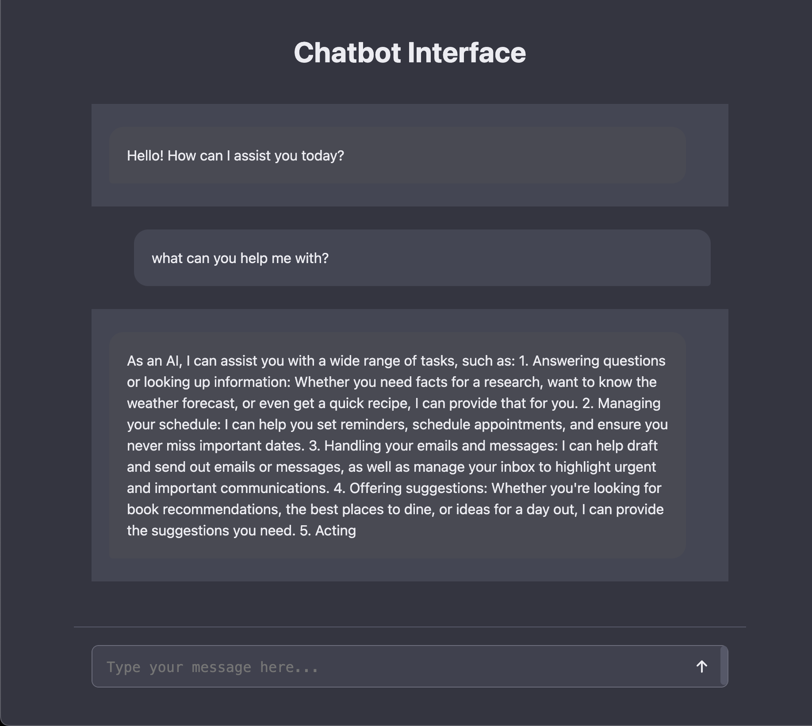

# Ruby AI Chatbot

A simple chatbot implementation in Ruby that can run in both console and server modes, powered by OpenAI's GPT models.

## Prerequisites

- Ruby installed on your system
- OpenAI API key

## Installation

1. Clone the repository
2. Install required gems:

```bash
bundle install
```

3. Create a `.env` file in the root directory:

```bash
cp .env.example .env
```

4. Update the `.env` file with your OpenAI API key:

```bash
OPENAI_API_KEY=your_api_key_here
```

## Usage

Run the chatbot with:

```bash
ruby chatbot_runner.rb
```

### Console Mode

1. Start the chatbot:

```bash
ruby chatbot_runner.rb
```

2. When prompted, type `console` to enter console mode
3. Type your questions and receive responses
4. Type `exit` to quit

Example session:

```bash
> ruby chatbot_runner.rb

Welcome to the chatbot! I'm here to help you with your questions.
If you would like to run the chatbot in console mode, please type 'console'.
If you would like to run the chatbot in server mode, please type 'server'.
Please enter 'exit' at any time to leave.

> console

Welcome to the chatbot console! Please enter your question or type 'exit' to leave.

You: What is Ruby?
Chatbot: Ruby is a dynamic, object-oriented programming language...

You: exit
```

### Server Mode

1. Start the chatbot:

```bash
ruby chatbot_runner.rb
```

2. When prompted, type `server` to start the server
3. The server will run on `http://localhost:4567`

Testing the server:

1. Test if the server is running:

```bash
curl http://localhost:4567
```

2. Test the chat endpoint:

```bash
curl -X POST http://localhost:4567/chat \
  -H "Content-Type: application/json" \
  -d '{"prompt":"Hello, how are you?"}'
```

### Web Interface Example

A simple web interface (`chat.html`) is provided to demonstrate how to interact with the chatbot server:

1. Start the chatbot server:

```bash
ruby chatbot_runner.rb
# Type 'server' when prompted
```

2. Open `chat.html` in your web browser
   - A modern, dark-themed chat interface will appear
   - Type messages in the input box at the bottom
   - Press Enter or click the arrow to send
   - Messages will appear in chat bubbles
   - Use Shift+Enter for multi-line messages

The web interface demonstrates:

- How to make API calls to the chatbot server
- Basic chat UI implementation
- Handling server responses
- Error handling for failed requests

You can use this as a starting point for building your own chat interface or integrate the API into your existing applications.



## API Endpoints

- `GET /` - Check if server is running
- `POST /chat` - Send a chat message
  - Request body: `{"prompt": "Your question here"}`
  - Response: `{"reply": "Chatbot's response"}`
